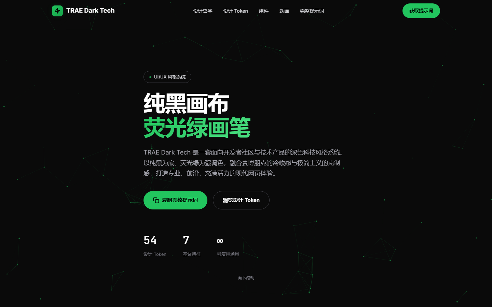
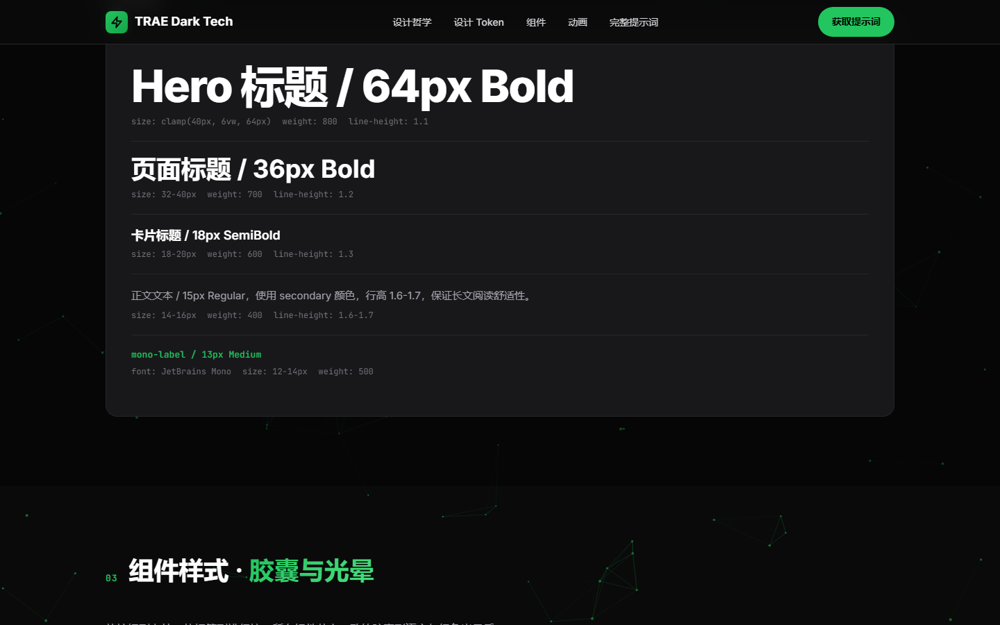
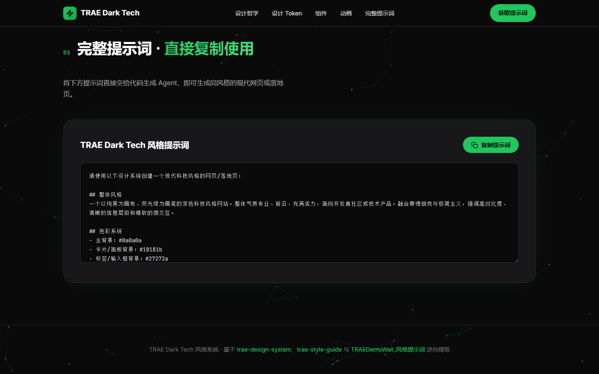

# Beautiful Web Template

一组精心整理的精美 HTML 落地页模板合集，每套模板探索一种独特的网页设计风格。

> **原始设计提示词来源：** 部分模板基于 [designprompts.dev](https://www.designprompts.dev) 的原始设计提示词，其余为本人整理的精美网页模板合集。英文版文档见 [README_en.md](./README_en.md)。

你可以在交互式首页中浏览、预览并复制这些模板，也可以在下方的画廊中查看。

## 画廊

### [Academia](./templates/Academia/)

  
  
  

> 学院派美学，古老图书馆气息，温暖纸张质感，传统衬线字体，金/绯红点缀。

### [Art Deco](./templates/Art-Deco/)

  
  
  

> 1920 年代盖茨比式的优雅，几何精准，金属金色调点缀，建筑式对称，奢华传承。

### [Aurora Mesh](./templates/Aurora-Mesh/)

  
  
  

> 流动的网格渐变，极光效果，鲜明色彩过渡，受 Stripe 与 Vercel 启发的现代初创美学。

### [Bauhaus](./templates/Bauhaus/)

  
  
  

> 大胆的几何现代主义，以圆、方、三角为基本形。三原色（红/蓝/黄）调色板配以硬朗黑边和硬阴影。兼具功能性与构成主义不对称的艺术感。

### [Bold Typography](./templates/Bold-Typography/)

  
  
  

> 字体驱动的设计，将巨型排版作为主要视觉元素。超大标题、极致对比与戏剧性留白，打造海报式构图，让文字成为艺术。

### [Botanical](./templates/Botanical/)

  
  
  

> 柔和、质朴、优雅的自然灵感设计。有机形态、大圆角、纸张颗粒质感、柔和大地色，以及透出温暖与自然奢华感的精致衬线字体。

### [Brutalist Pixel](./templates/Brutalist-Pixel/)

  
  
  

> 复古像素游戏 CRT 美学与粗野主义设计融合。近黑背景配 3px 硬白边框，零圆角，硬偏移阴影。采用 Press Start 2P 像素字体、Space Mono 等宽字体、霓虹绿点缀（#22c55e）、CRT 扫描线叠加、像素网格背景、故障动画与阶梯式过渡，唤起 8 位游戏机与早期黑客终端的质感。

### [Claymorphism](./templates/Claymorphism/)

  
  
  

> 超写实 3D 美学，模拟柔软可充气的黏土物件，多层阴影堆叠、糖果店般鲜艳色彩、触觉微交互与有机漂浮的环境元素，营造高级而趣味的数字玩具体验。

### [Cyberpunk](./templates/Cyberpunk/)

  
  
  

> 黑底高对比霓虹，故障动画，终端/等宽字体，科技感装饰。受 80 年代科幻与黑客文化启发的反乌托邦数字美学。

### [Enterprise](./templates/Enterprise/)

  
  
  

> 现代 SaaS 美学，在专业与亲和之间取得平衡。鲜艳的靛蓝/紫色渐变、柔和彩色阴影、等距纵深感与干净的几何无衬线字体。

### [Flat Design](./templates/Flat-Design/)

  
  
  

> 一种以移除深度提示（阴影、斜面、渐变）为核心的设计哲学，转而倚重纯粹的色彩、字体与布局。利落、扁平、几何化，配以大胆的色块分割。

### [Glassmorphism](./templates/Glassmorphism/)

  
  
  

> 苹果风格美学，搭配丰富的网格渐变、高级感模糊与克制的布局。

### [Industrial](./templates/Industrial/)

  
  
  

> 受 Dieter Rams 与 Teenage Engineering 启发的高保真工业拟物美学。触感新拟态元素、哑光塑料表面与安全橙点缀。每个组件都模拟实体硬件，具备逼真光照、机械交互与螺丝、散热孔、LED 指示灯等制造细节。

### [Kinetic](./templates/Kinetic/)

  
  
  

> 动效优先的设计，字体是主要视觉媒介。无限跑马灯、视口缩放文字、滚动触发动画与激进的大写样式。高对比、粗野主义能量，富有节奏感的运动。

### [Luxury](./templates/Luxury/)

  
  
  

> 优雅的衬线字体配单色调色板与金色点缀。极慢动画、慷慨留白与建筑般的精准。高端时尚杂志的编辑美学，通过细腻阴影与层次营造深度。

### [Material Design](./templates/Material-Design/)

  
  
  

> 活泼、动感的色彩提取，胶囊形按钮与分明的层级状态。基于 Google Material Design 3，增强深度与微交互。

### [Maximalism](./templates/Maximalism/)

  
  
  

> 冲突的图案、密集的布局、过饱和的色彩、刻意的视觉杂乱。多多益善。

### [Minimal Dark](./templates/Minimal-Dark/)

  
  
  

> 建立在深石板色调与暖琥珀点缀之上的氛围感深色模式设计系统。环境光晕效果、玻璃般半透明卡片、几何字体与充裕的呼吸空间。空灵而沉稳——宛如午夜中的高级应用。

### [Modern Dark](./templates/Modern-Dark/)

  
  
  

> 电影般高精度的深色模式设计，通过动画渐变光斑营造分层环境光、鼠标追踪聚光效果与精心打磨、质感如高端软件的微交互。

### [Monochrome](./templates/Monochrome/)

  
  
  

> 建立在纯黑白之上的冷峻编辑设计系统。无点缀色——唯有戏剧性对比、超大衬线字体与精准的几何布局。唤起高端时尚编辑与建筑作品集的质感。克制、精致、不妥协的大胆。

### [Neo Brutalism](./templates/Neo-Brutalism/)

  
  
  

> 模仿印刷设计与 DIY 朋克文化的原始高对比美学。奶油色背景、粗黑边框（4px）、零模糊硬偏移阴影、冲突的鲜艳色（热红、明黄、柔紫），以及重字重的 Space Grotesk 字体。拥抱不对称、旋转、贴纸式层叠与有组织的视觉混乱。

### [Neumorphism](./templates/Neumorphism/)

  
  
  

> 通过单色背景上的双向阴影实现凸出与凹陷元素。柔软、有触感、物理感强，且具备出色的可访问性。

### [Newsprint](./templates/Newsprint/)

  
  
  

> 纯黑白、高对比、紧凑网格、报纸美学、锐利线条、编辑深度。

### [Organic](./templates/Organic/)

  
  
  

> 大地灵感的调色板，含苔藓绿、赤陶与沙色调。有机水滴形、颗粒质感叠加、不对称圆角与柔和阴影。拥抱侘寂哲学，透出温暖与自然的不完美。

### [Playful Geometric](./templates/Playful-Geometric/)

  
  
  

> 充满活力、高能量的美学，将稳定的结构网格与俏皮的几何装饰相结合。依靠明亮的纯色、简单的基本形状（圆、三角、波浪线）与触感交互，营造出令人联想到现代 Memphis 设计的友好乐观氛围。

### [Professional](./templates/Professional/)

  
  
  

> 以优雅衬线字体为中心的编辑风极简设计系统。温暖象牙白背景配细腻纸张质感、考究间距、分隔线与古典比例，营造永恒而文学化的美学。通过分层渐变与多色调阴影增强深度。设计以克制与排印之美低语出精致。

### [Retro](./templates/Retro/)

  
  
  

> 丑酷的 90 年代怀旧美学，Windows 95 斜面 UI、系统字体、明亮三原色、跑马灯滚动文字与最大化的视觉混乱。

### [SaaS](./templates/SaaS/)

  
  
  

> 兼具简洁美学与动感执行的大胆、极简现代视觉系统。标志性的电光蓝渐变、考究的双字体搭配（Calistoga + Inter）、动画首屏图形、反差色区块与贯穿全局的微交互。专业而具设计前瞻性——自信而不杂乱。

### [Sketch](./templates/Sketch/)

  
  
  

> 有机的摇摆边框、手写体字体、纸张质感与俏皮的不完美。每个元素都仿佛用马克笔和铅笔在质感纸上手绘而成。

### [Swiss Minimalist](./templates/Swiss-Minimalist/)

  
  
  

> 对国际字体排印风格（1950 年代）的严谨实现。以客观字体、无衬线字体（Inter）、带细腻纹理图案的数学网格，以及严格的黑/白/红调色板为特征。优先考虑可读性、精准、非对称组织，以及通过分层图案营造的视觉深度。

### [TRAE Dark Tech](./templates/TRAE-Dark-Tech/)

  
  
  

> 以纯黑为画布、荧光绿为画笔的深色科技风格。流动的粒子网络背景、高对比度的视觉层级与精致的胶囊形 UI 组件，打造专业、前沿、充满活力的现代开发者社区体验。

### [Terminal](./templates/Terminal/)

  
  
  

> 原始、功能性且复古未来主义的命令行界面美学。高对比、等宽精准与闪烁光标。

### [Vaporwave](./templates/Vaporwave/)

  
  
  

> 一场怀旧、霓虹弥漫的 80 年代复古未来主义之旅。高对比霓虹粉与青色映衬深邃虚空紫。数字网格、发光地平线、超现实日落渐变与 CRT 扫描线叠加，构筑沉浸式合成世界。

### [Web3](./templates/Web3/)

  
  
  

> 受比特币与去中心化金融启发的大胆未来主义美学。深邃虚空背景配比特币橙点缀、金色高光、发光元素与精准的数据可视化。
